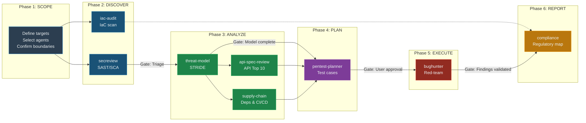
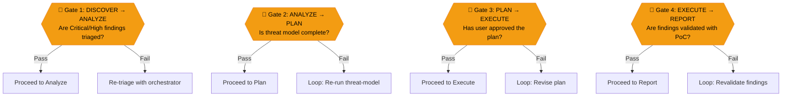
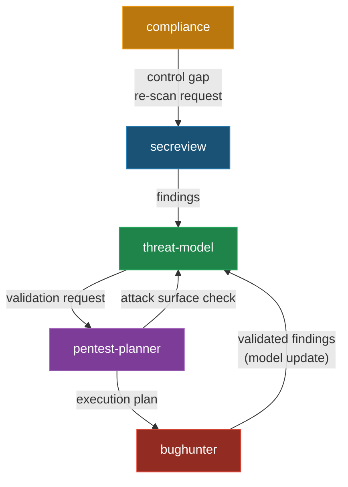
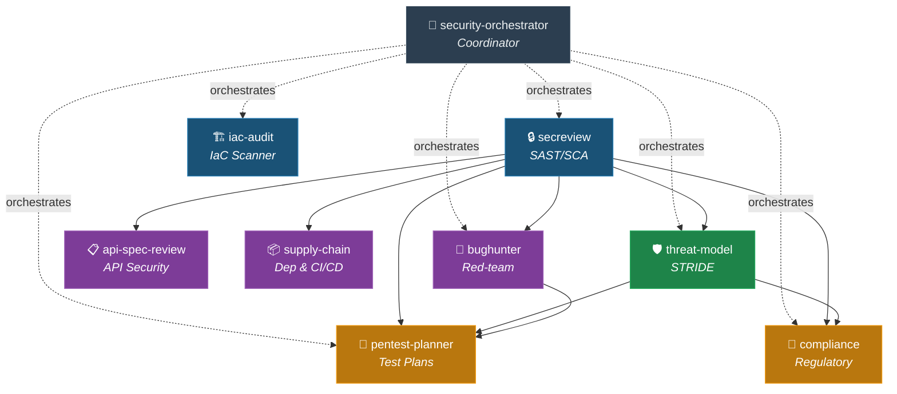
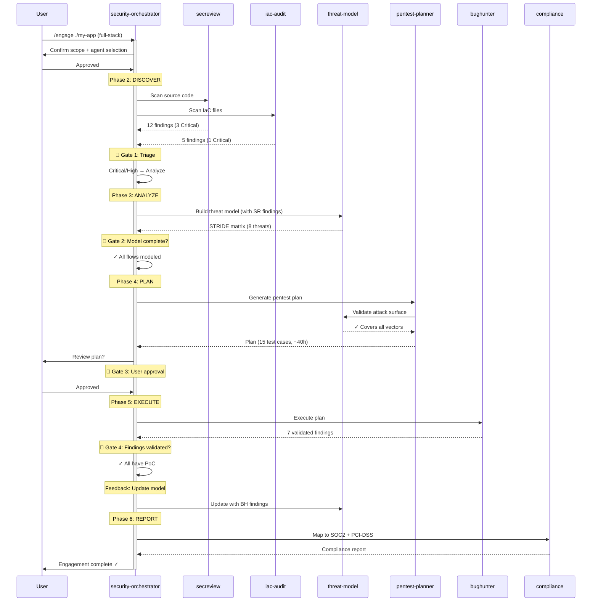

# Security Agent Suite for Kiro CLI

Nine security-focused Kiro agents orchestrated using the **BMAD methodology** (Breakthrough Method of Agile AI-Driven Development) — specialized personas with structured handoffs, quality gates, and iterative feedback loops across the full security lifecycle.

## BMAD Methodology

This suite adapts BMAD's multi-agent orchestration framework for security engagements:

- **Specialized Personas** — Each agent has a defined identity, communication style, and expertise domain
- **Structured Artifacts** — Standardized report schemas with cross-references (`[SR-SAST-003]`, `[TM-T4]`)
- **Quality Gates** — Mandatory validation checkpoints before work flows downstream
- **Feedback Loops** — Agents iteratively refine each other's output (findings feed back to update models)
- **Orchestration** — A coordinator agent sequences work, enforces gates, and decides what to run

### Engagement Lifecycle



### Quality Gates



### Feedback Loops



## Agents

| Agent | Role | Persona | Depends on |
|-------|------|---------|------------|
| **security-orchestrator** | Engagement coordinator | Senior security program manager | — |
| **secreview** | SAST/SCA reviewer | AppSec engineer, zero false-positive tolerance | — |
| **iac-audit** | IaC scanner | Cloud security architect, CIS-grounded | — |
| **bughunter** | Red-team operator | Senior pentester, evidence-mandatory | secreview |
| **api-spec-review** | API security reviewer | API specialist, spec-driven | secreview |
| **supply-chain** | Dependency & CI/CD auditor | Supply chain researcher, reachability-focused | secreview |
| **threat-model** | STRIDE modeler | AppSec architect, scan-corroborated | secreview |
| **compliance** | Regulatory mapper | GRC specialist, auditor-readable | secreview, threat-model |
| **pentest-planner** | Pentest plan generator | Engagement manager, intelligence-driven | secreview, threat-model, bughunter |

### Agent Dependency Graph



### Structured Artifacts & Cross-References

Each agent writes to a standard output path and uses a cross-reference prefix:

| Agent | Output | Prefix | Example Reference |
|-------|--------|--------|-------------------|
| secreview | `reports/secreview/` | SR | `[SR-SAST-003]` |
| iac-audit | `reports/iac-audit/` | IAC | `[IAC-007]` |
| bughunter | `reports/bughunter/` | BH | `[BH-SQLI-001]` |
| api-spec-review | `reports/api-spec-review/` | API | `[API-BOLA-002]` |
| supply-chain | `reports/supply-chain/` | SC | `[SC-CVE-2024-1234]` |
| threat-model | `reports/threat-models/` | TM | `[TM-T4]` |
| compliance | `reports/compliance/` | CO | `[CO-PCI-6.2]` |
| pentest-planner | `reports/pentest-plans/` | PP | `[PP-TC-012]` |

See [`reports-schema.md`](reports-schema.md) for the full artifact format specification.

### Typical End-to-End Workflow (Orchestrated)



## Prerequisites

- [Kiro CLI](https://kiro.dev) installed and configured
- Recommended: [Semgrep](https://semgrep.dev) for automated SAST
- Recommended: [checkov](https://www.checkov.io/) or [trivy](https://trivy.dev/) for IaC scanning
- Optional: Burp Suite, Playwright, and Semgrep MCP servers (for bughunter)

## Install All

### Windows (PowerShell)

```powershell
.\install-all.ps1
```

### Linux / macOS (Bash)

```bash
chmod +x install-all.sh
./install-all.sh
```

Agents are installed in dependency order — each agent's requirements are satisfied before it installs.

## Install Individually

Each agent can be installed separately. Dependencies are checked and auto-installed from sibling directories:

```powershell
# Windows — no-dependency agents
.\secreview\install.ps1
.\iac-audit\install.ps1
.\security-orchestrator\install.ps1

# Depends on secreview (auto-installed if missing)
.\bughunter\install.ps1
.\api-spec-review\install.ps1
.\supply-chain\install.ps1
.\threat-model\install.ps1

# Multiple dependencies (auto-installed if missing)
.\compliance\install.ps1          # needs: secreview, threat-model
.\pentest-planner\install.ps1     # needs: secreview, threat-model, bughunter
```

```bash
# Linux / macOS
./secreview/install.sh
./iac-audit/install.sh
./security-orchestrator/install.sh
./bughunter/install.sh
./api-spec-review/install.sh
./supply-chain/install.sh
./threat-model/install.sh
./compliance/install.sh
./pentest-planner/install.sh
```

## Quick Start (Orchestrated)

```bash
# Start the orchestrator — it handles everything
kiro chat --agent security-orchestrator
> /engage ./my-application

# Or run agents individually
kiro chat --agent secreview
> review ./src
```

## Directory Structure

```
.
├── README.md                        ← This file
├── reports-schema.md                ← BMAD artifact format specification
├── install-all.ps1                  ← Install all (Windows)
├── install-all.sh                   ← Install all (Linux/macOS)
├── security-orchestrator/           ← Orchestrator (BMAD coordinator)
├── secreview/                       ← Layer 1: Base SAST/SCA agent
├── iac-audit/                       ← Layer 1: IaC scanner (standalone)
├── bughunter/                       ← Layer 2: Red-team operator
│   └── skills/                      ← 51 skill folders + 14 commands
├── api-spec-review/                 ← Layer 2: API security reviewer
├── supply-chain/                    ← Layer 2: Dependency & CI/CD auditor
├── threat-model/                    ← Layer 3: STRIDE threat modeler
│   └── resources/                   ← Templates + STRIDE reference
├── compliance/                      ← Layer 4: Regulatory mapper
└── pentest-planner/                 ← Layer 4: Pentest plan generator
```

## Individual Agent Docs

- [`security-orchestrator/`](security-orchestrator/) — Engagement lifecycle coordinator
- [`secreview/README.md`](secreview/README.md) — SAST workflow and output format
- [`iac-audit/`](iac-audit/) — IaC scanning (Terraform, Docker, K8s)
- [`bughunter/README.md`](bughunter/README.md) — Full command reference and coverage
- [`api-spec-review/`](api-spec-review/) — OWASP API Top 10 analysis
- [`supply-chain/`](supply-chain/) — Dependency, SBOM, and CI/CD security
- [`threat-model/README.md`](threat-model/README.md) — STRIDE workflow and report format
- [`compliance/`](compliance/) — Regulatory framework mapping
- [`pentest-planner/`](pentest-planner/) — Pentest plan generation

## Uninstalling

**Windows:**
```powershell
@("security-orchestrator","secreview","iac-audit","bughunter","api-spec-review",
  "supply-chain","threat-model","compliance","pentest-planner") | ForEach-Object {
    Remove-Item "$env:USERPROFILE\.kiro\agents\$_.json" -ErrorAction SilentlyContinue
    Remove-Item -Recurse "$env:USERPROFILE\.kiro\agents\$_-resources" -ErrorAction SilentlyContinue
}
Remove-Item -Recurse "$env:USERPROFILE\.kiro\skills\bughunter" -ErrorAction SilentlyContinue
```

**Linux/macOS:**
```bash
for agent in security-orchestrator secreview iac-audit bughunter api-spec-review \
             supply-chain threat-model compliance pentest-planner; do
    rm -f ~/.kiro/agents/${agent}.json
    rm -rf ~/.kiro/agents/${agent}-resources
done
rm -rf ~/.kiro/skills/bughunter
```
